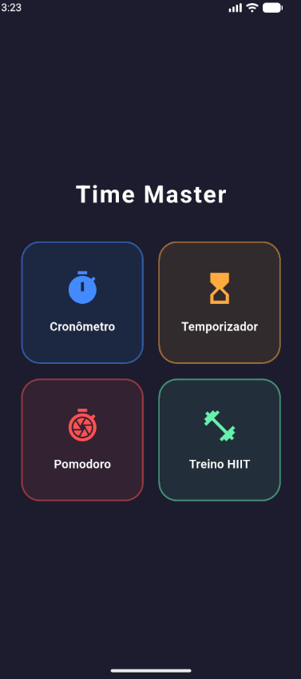
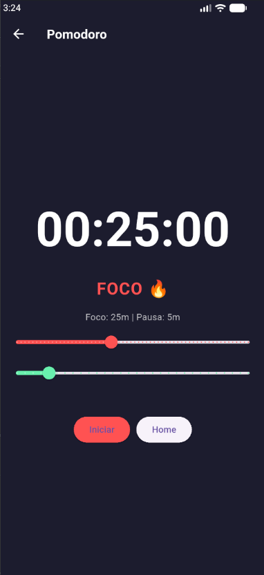
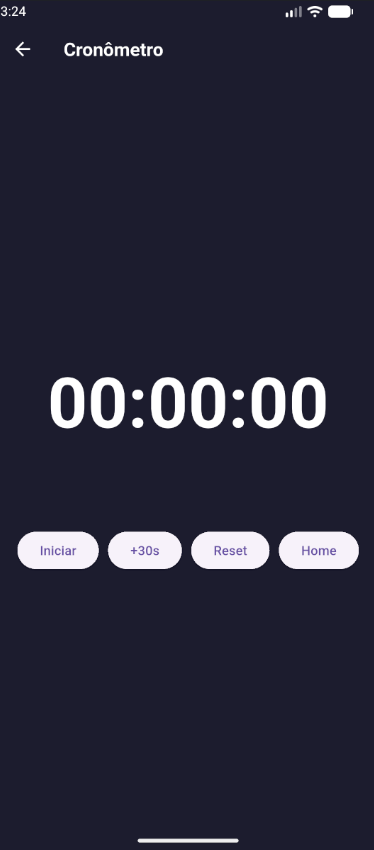
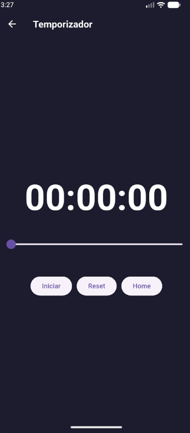

# ⏳ Time Master - O Teu Gestor de Tempo Definitivo

O **Time Master** é uma aplicação completa de gestão de tempo desenvolvida em Flutter, focada em produtividade, foco e treino físico. Com uma interface moderna em Dark Mode, a aplicação oferece quatro ferramentas essenciais num único lugar.

## 🚀 Funcionalidades

### ⏱️ Cronómetro
Contagem progressiva simples e precisa para medir qualquer atividade.

### ⏲️ Temporizador
Configuração rápida de contagem regressiva com alerta sonoro ao finalizar.

### 🍅 Método Pomodoro
Foca-te nas tuas tarefas com ciclos personalizáveis de **Trabalho** e **Pausa**.
- Alternância automática entre estados.
- Início automático do próximo ciclo.
- Avisos sonoros integrados.

### 🔥 Treino HIIT (Intervalado)
Leva os teus treinos ao próximo nível com o sistema de **Séries**.
- Configura tempo de Ação, Descanso e número de Rounds.
- Indicadores visuais claros para cada fase.
- Alerta sonoro em cada transição.

---

## 📸 Screenshots

Aqui podes ver a interface da aplicação em funcionamento:

| Home | Treino | Pomodoro | Cronometro | Temporizador |
| :---: | :---: | :---: | :---: |
|  |  |  |  |  |

---

## 🛠️ Tecnologias Utilizadas

- **Flutter / Dart**
- **Arquitetura MVC** (Model-View-Controller) para código limpo.
- **Layout Adaptável**: Compatível com diferentes tamanhos de ecrã.

## ⚙️ Como Executar o Projeto

1. **va em releases - baixe o apk e instale em seu android **
